# BinSentry Agent

面向 IoT 固件 Web/CGI 场景的智能二进制漏洞分析平台。项目结合 IDA Pro / Hex-Rays 静态分析、大模型 Agent 多轮推理、Source-to-Sink 验证、CVE 情报检索和可视化工作台，辅助分析人员从固件目录中定位重点二进制、发现可疑漏洞链路并整理证据。

> 原项目名为 `VulnAgent-V2`，当前推荐项目展示名为 **BinSentry Agent**（前端界面中仍显示 VulnAgent）。

## 目录

- [项目定位](#项目定位)
- [界面预览](#界面预览)
- [整体架构](#整体架构)
- [分析工作流](#分析工作流)
- [Agent 推理闭环](#agent-推理闭环)
- [核心能力](#核心能力)
- [数据持久化设计](#数据持久化设计)
- [项目结构](#项目结构)
- [技术栈](#技术栈)
- [快速启动](#快速启动)
- [常用命令](#常用命令)
- [典型测试提示词](#典型测试提示词)
- [测试](#测试)
- [安全与仓库注意事项](#安全与仓库注意事项)
- [项目说明](#项目说明)

## 项目定位

传统固件二进制漏洞分析依赖人工逆向经验，流程重复、证据整理成本高，通用 LLM 直接分析大段伪代码又容易出现上下文遗忘和误报。BinSentry Agent 的目标不是替代人工验证，而是把固件初筛、IDA 信息检索、函数分析、证据收集、漏洞链路验证和情报关联组织成一个可审计的 Agent 工作流。

核心思路：

- **确定性扫描**负责批量发现路由、Source、Sink 和高风险候选。
- **LLM Agent** 负责围绕具体问题调用只读 IDA 工具并补齐证据。
- **Harness** 负责统一运行边界、Trace、错误处理和持久化。
- **SQLite** 保存会话、工具事件、调查状态、扫描报告和运行轨迹。
- **React 前端**提供固件初筛、Agent Chat、会话管理、漏洞报告、CVE Intelligence 和 Trace 回放。

### 态势总览（Dashboard）

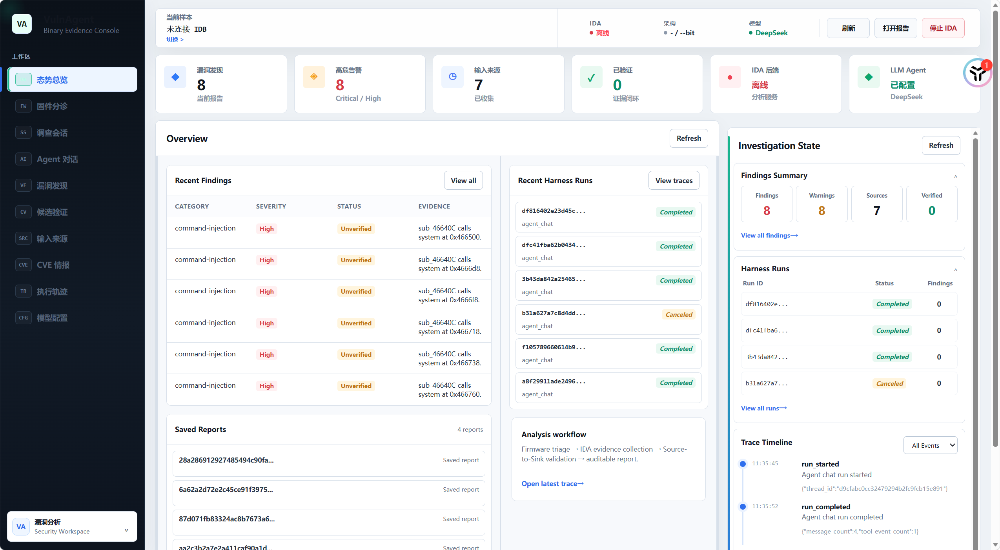

### Agent 对话（Agent Chat）

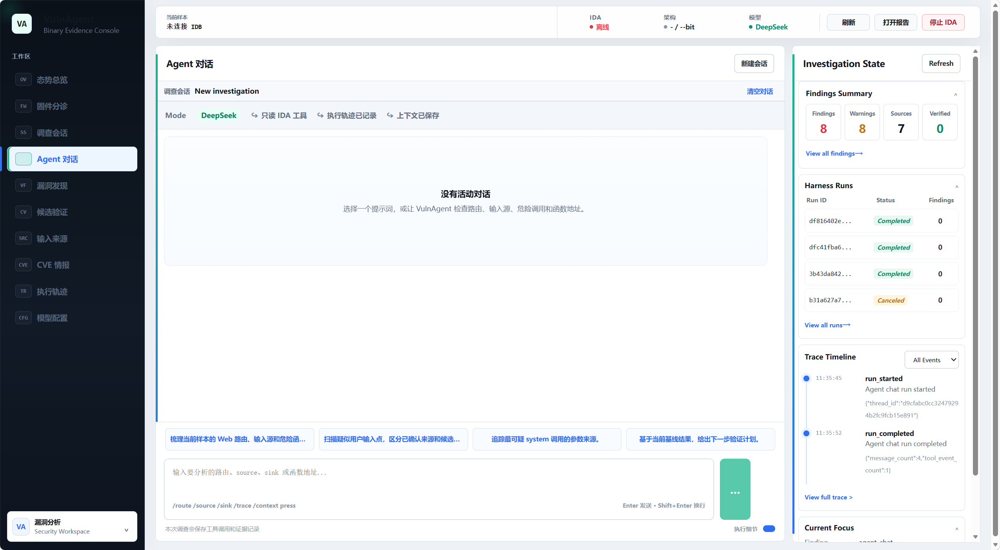

### 固件分诊（Firmware Triage）

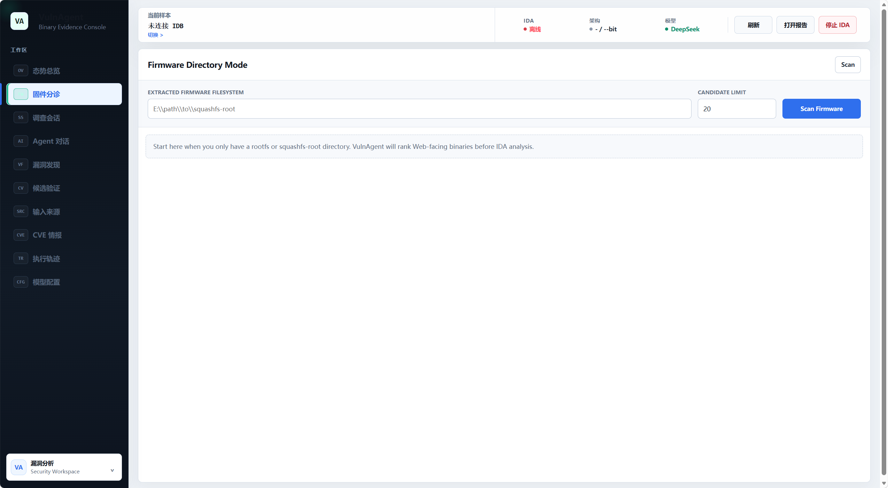

### 调查会话（Sessions）

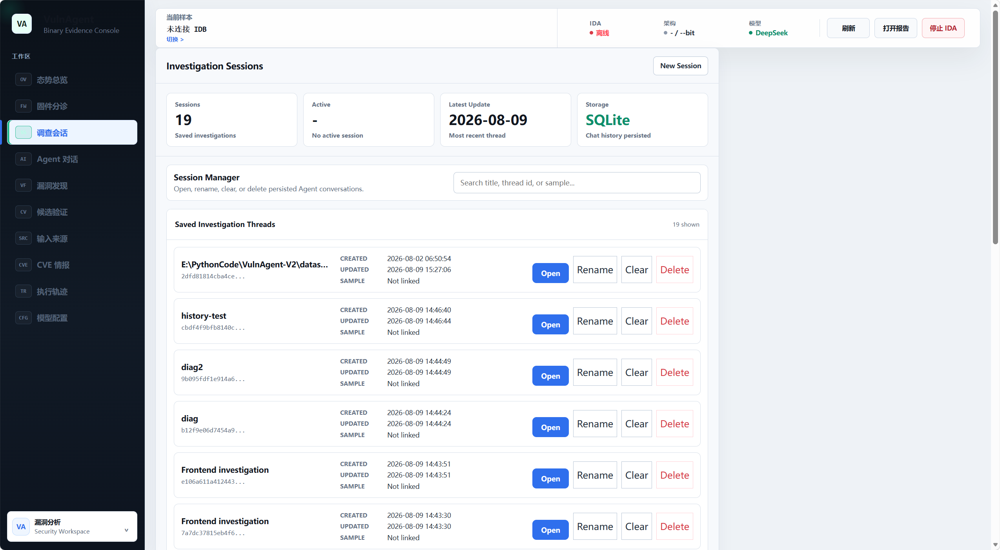

### 漏洞发现（Findings）

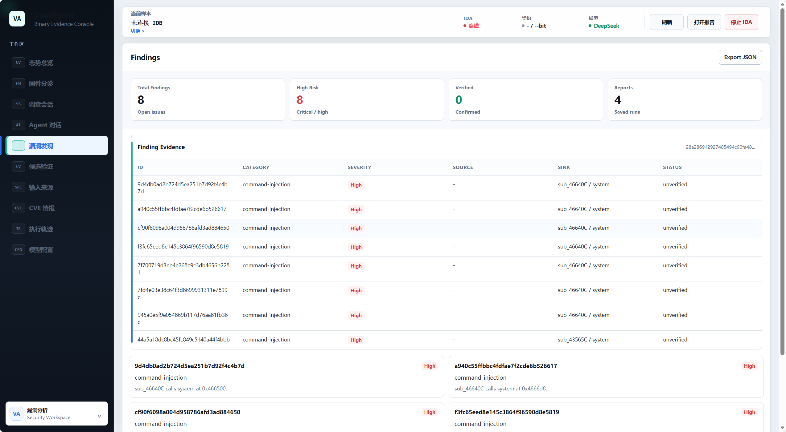

### 候选验证（Candidate Validation）

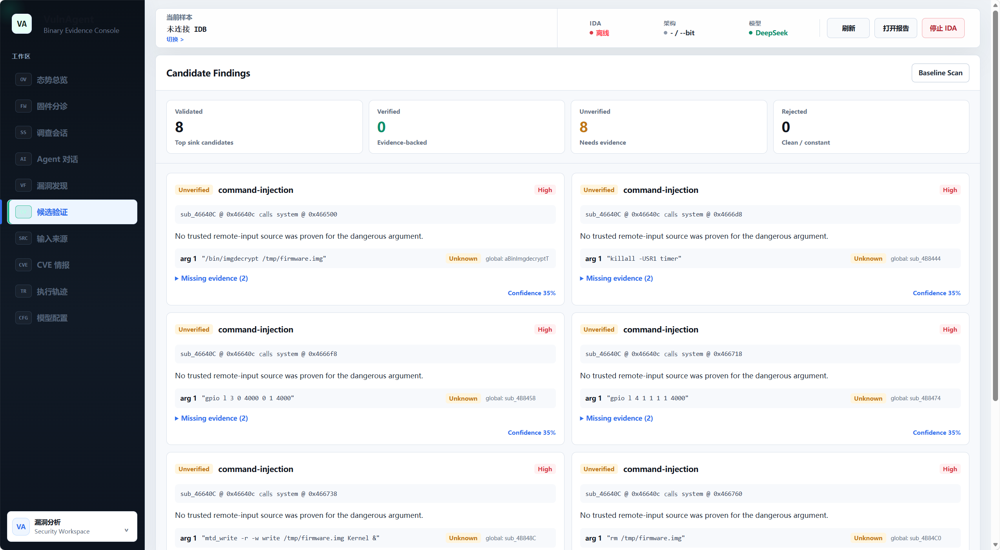

### CVE 情报（CVE Intelligence）

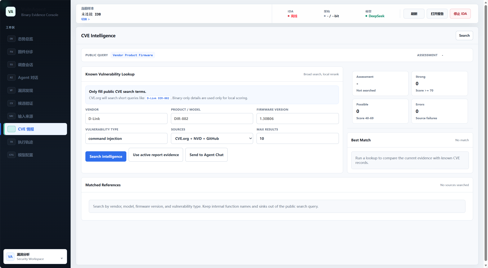

### 模型配置（Model Settings）

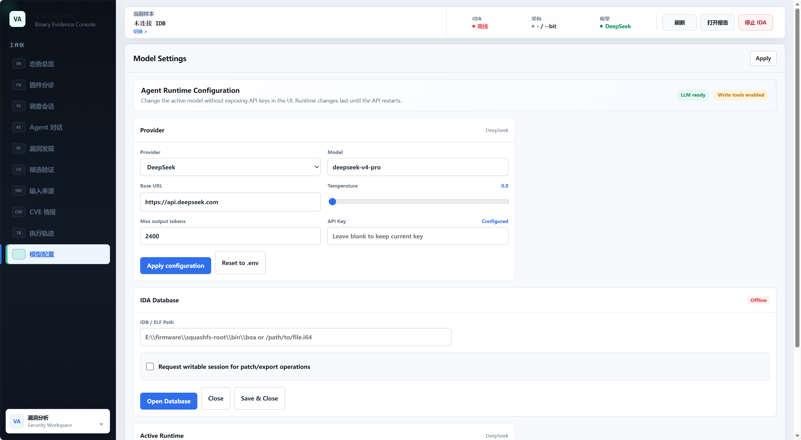

## 整体架构

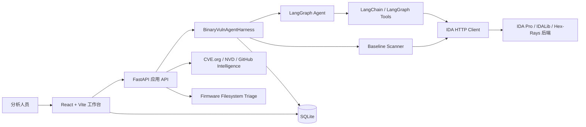

## 分析工作流

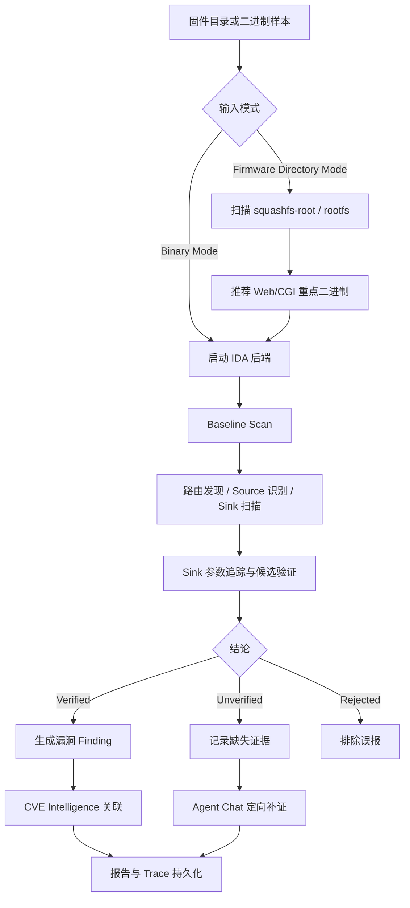

## Agent 推理闭环

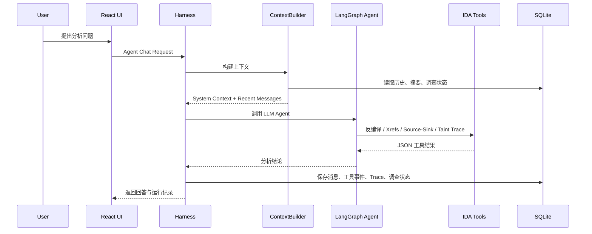

## 核心能力

| 模块 | 能力 |
| --- | --- |
| Firmware Triage | 扫描固件文件系统，按 Web 入口、CGI 特征、危险函数、配置引用等指标推荐 IDA 分析目标 |
| IDA Backend | 封装反编译、函数列表、交叉引用、字符串、导入函数、调用关系、参数来源追踪等能力 |
| Baseline Scan | 批量发现 Web 路由、用户输入 Source、危险 Sink 和 source-to-sink 候选链路 |
| Validation Planner | 对高风险 Sink 参数做来源追踪，将候选标记为 verified / unverified / rejected |
| LangGraph Agent | 支持多轮工具调用、上下文感知分析、定向补证和自然语言解释 |
| Context Memory | 滑动窗口、语义摘要、Token 预算、结构化调查状态和 `/context press` 手动压缩 |
| Harness Trace | 为每次 Agent Chat、Baseline Scan、上下文压缩记录 run_id、状态、耗时和事件时间线 |
| CVE Intelligence | 使用 CVE.org、NVD、GitHub 做宽搜索，再用固件型号、漏洞类型和本地证据重排匹配结果 |
| React Workbench | 提供 Agent Chat、会话管理、固件初筛、报告查看、候选漏洞、CVE 情报和 Trace 回放页面 |

## 数据持久化设计

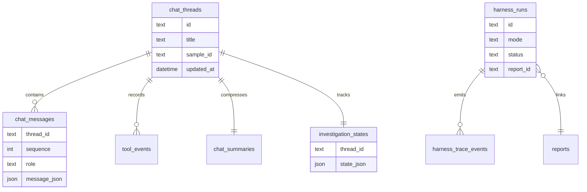

## 项目结构

```text
bin-sentry-agent/           # 仓库根（原 VulnAgent-V2）
  README.assets/            # 界面截图（Typora 插入，见「界面预览」）
  frontend/                 React + Vite 前端工作台
  vulnagent/
    agent/                  LangGraph Agent、上下文管理、执行治理、Baseline Scan
    firmware/               固件目录扫描与重点二进制推荐
    harness/                统一任务运行层、run_id、trace、结构化结果
    ida/                    IDA FastAPI 后端、IDALib / Hex-Rays 适配
    clients/                IDA HTTP 客户端
    tools/                  Agent 可调用工具封装
    intel/                  CVE.org / NVD / GitHub 情报检索与本地重排
    storage/                SQLite 持久化
    skills/                 固件 Web/CGI 分析提示词与领域规则
    reports/                漏洞报告模型、存储与 API 路由
    tests/                  单元测试
  data/                     本地 SQLite 数据库，默认不提交
  reports/                  本地分析报告，默认不提交
```

## 技术栈

- Python、FastAPI、SQLite
- IDA Pro / IDALib / Hex-Rays
- LangGraph、LangChain
- DeepSeek API / OpenAI-compatible API
- React、Vite、TypeScript
- CVE.org、NVD、GitHub Intelligence

## 快速启动

### 1. 安装 Python 依赖

```powershell
conda create -n BinSentry python=3.10 -y
conda activate BinSentry
pip install -r vulnagent/requirements.txt
```

### 2. 配置环境变量

```powershell
copy .env.example .env
```

至少配置一个 LLM API Key：

```env
DEEPSEEK_API_KEY=your-api-key
DEEPSEEK_API_URL=https://api.deepseek.com
DEEPSEEK_MODEL=deepseek-v4-flash

IDA_BACKEND_URL=http://127.0.0.1:8765
VULN_DB_PATH=./data/vulnagent.db
VULN_ENABLE_IDB_WRITES=false
VULN_AGENT_DIRECT_IDB_WRITES=false
```

不要提交 `.env`、IDA 数据库、SQLite 数据库、固件样本或本地报告。

### 3. 启动应用 API

```powershell
python -m vulnagent api --host 127.0.0.1 --port 8787
```

### 4. 启动 React 前端

```powershell
cd frontend
npm install
npm run dev
```

访问：

```text
http://127.0.0.1:5173
```

### Agent 直接补丁模式（direct patch mode）

当启用直接写工具时，Agent Chat 可以修改当前激活的 IDA 数据库。请仅在复制的 IDB / 输入文件副本上使用该模式。

启用 API 写开关：

```env
VULN_ENABLE_IDB_WRITES=true
VULN_AGENT_DIRECT_IDB_WRITES=true
```

以非 `--read-only` 方式重启 IDA 后端：

```powershell
python -m vulnagent --idb "E:\path\to\target.i64" --host 127.0.0.1 --port 8765
```

随后可让 Agent Chat 执行 patch、NOP、重命名、注释或保存。支持的操作包括：

- 精确补丁字节，可选 `expected_original_hex` 校验
- NOP 填充字节
- 反转 / 强制条件跳转
- 重命名函数
- 设置函数注释
- 保存 IDA 数据库

除非你希望 Agent 直接在对话中执行补丁操作，否则保持 `VULN_AGENT_DIRECT_IDB_WRITES=false`。

### 5. 选择启动模式

如果已经知道要分析的二进制文件，直接进入 **Binary Mode**：

```powershell
python -m vulnagent --idb "E:\path\to\sample.i64" --host 127.0.0.1 --port 8765 --read-only
```

如果还不确定应该分析哪个二进制文件，先进入 **Firmware Directory Mode**：

```text
打开前端 -> Firmware Triage -> 输入 squashfs-root / rootfs 目录 -> Scan Firmware
```

前端会根据 Web/CGI 特征、危险函数、配置引用、路由字符串等指标推荐重点二进制。选择目标后，再用推荐路径启动 IDA 后端：

```powershell
python -m vulnagent --idb "E:\path\to\squashfs-root\sbin\lighttpd" --host 127.0.0.1 --port 8765 --read-only
```

推荐的使用顺序：

```text
未知目标二进制：
  API -> React 前端 -> Firmware Triage -> 选择二进制 -> IDA 后端 -> Agent Chat

已知目标二进制：
  API -> IDA 后端 -> React 前端 -> Agent Chat
```

## 常用命令

固件目录扫描：

```powershell
python -m vulnagent firmware-triage "E:\path\to\squashfs-root" --limit 20
```

CVE 情报检索：

```powershell
python -m vulnagent intel --vendor "D-Link" --product "DIR-882" --vuln-type "command injection" --sources cveorg,nvd,github
```

手动压缩 Agent Chat 上下文：

```text
/context press
```

## 典型测试提示词

```text
请扫描这个固件目录，推荐最值得用 IDA 分析的 Web/CGI 二进制文件。
```

```text
请开始分析这个二进制文件中可能存在的命令注入漏洞，先找 Web 路由、用户输入 Source 和危险 Sink。
```

```text
请围绕 system 调用追踪参数来源，说明是否能从 Web/CGI 用户输入到达该 Sink。
```

```text
请根据当前 finding 检索是否已有公开 CVE，并说明哪些匹配可信、哪些只是关键词重合。
```

## 测试

```powershell
python -m compileall -q vulnagent
python -m unittest vulnagent.tests.test_vulnerability_workflow
python -m unittest vulnagent.tests.test_firmware_scanner
python -m unittest vulnagent.tests.test_validation_planner
python -m unittest vulnagent.tests.test_vulnerability_intel
```

前端检查：

```powershell
cd frontend
npx tsc --noEmit
npm run build
```

## 安全与仓库注意事项

`.gitignore` 默认忽略：

- `.env`
- `data/`
- `reports/`
- `dataset/`
- `frontend/dist/`
- `node_modules/`
- IDA 数据库文件：`.i64`、`.idb`、`.id0`、`.id1`
- SQLite 数据库文件：`.db`、`.sqlite`

提交前建议检查：

```powershell
git status
```

确认没有 API Key、固件样本、IDA 数据库、SQLite 数据库或本地报告进入暂存区。

## 项目说明

BinSentry Agent 更适合作为研究型和实验型二进制漏洞分析平台使用。它不能替代人工逆向验证，也不是通用自动漏洞挖掘器。它的价值在于把重复的信息检索、函数分析、证据整理和多轮推理过程自动化，让分析人员更快聚焦到可疑链路和关键证据。
